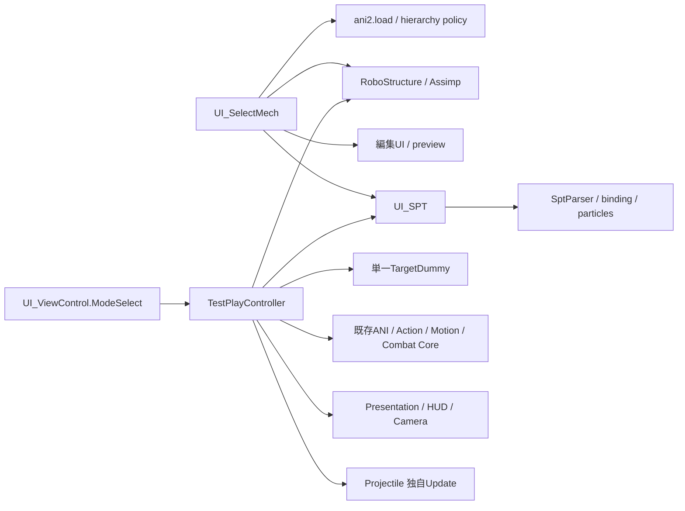
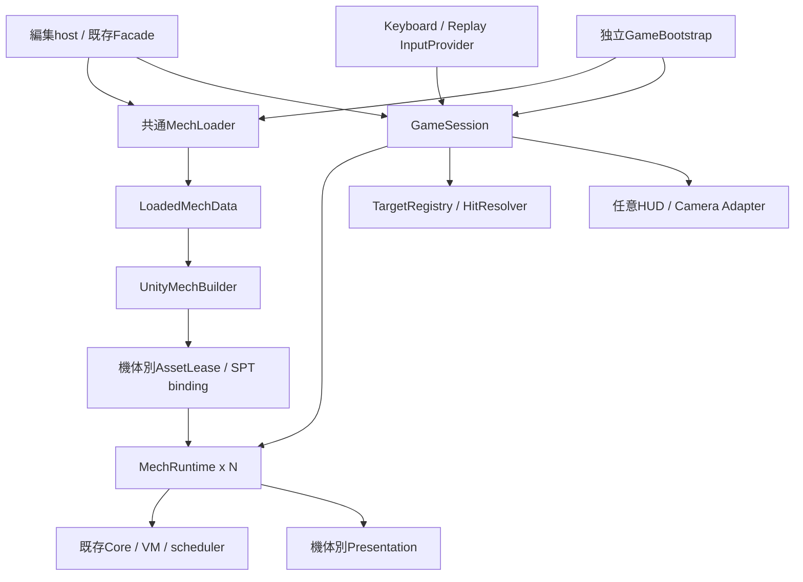

# P1-04 独立起動・機体・セッション境界

設計日: 2026-09-06。状態: **P1-04設計完了、P1-05未実装**。

本書は[承認済み計画](UNITY6000_6_ACCEPTANCE_AND_NEXT_TASKS.md)のP1-04成果物。以下の新しい型・APIは実装契約であり、現在呼び出せるAPIではない。現行コードの調査と文書検証を実施した。Unity実行・Player・戦闘の新規受入は行っていない。

## 1. 決定と範囲

- ANI compiler / VM / track scheduler / Action / Motion / Combat Coreを再利用する。Controllerは既存publicフィールド・クラス・Inspector参照を残すFacadeとし、小さな委譲先を段階追加する。asmdef移動、形式変更、プレビューへの別VM実装は含めない。
- 共通loaderはデータ読込と検査、Unity資産builderは階層・描画資産生成、機体runtimeは可変戦闘状態、sessionは時計・ID・対象集合・命中順・終了を所有する。
- 編集入口と独立入口を明示的なcontextで接続する。独立入口はUI_SelectMech / UI_SPT / UI_ViewControlやシーン内検索を必要としない。
- P1-05の最小範囲は1機体起動、次に2機体、type 1射撃とtype 57格闘、被弾・撃破・終了・再戦。ネットワーク、AI、全武器、原作複合形状、原作共有乱数列の再現は別タスク。
- 複数機体の更新順・対象球・乱数サービスはUnity側の契約。原作確定／原作高確度／原作推定／RealAniObserved／Unity代替の既存区分を保持する。

## 2. 現行依存と根拠

リンク先のメソッド名を参照点とする。行番号は変更で動くため固定しない。

| 現行入口・処理 | 依存／副作用 | 分離先・保持対象 |
| --- | --- | --- |
| [UI_SelectMech](../Assets/Scripts/UI_SelectMech.cs) `LoadDataAsync` | dropdownからpathを解決、旧ANI変換確認、`await ani.load`、階層方針適用、モデル構築、preview/UI更新、SPT読込 | path選択・変換確認・UI更新は編集Adapter。読込／既存階層方針を共通loaderへ委譲 |
| 同 `TryApplyAutomaticHierarchyRepairForLoad` | 旧ANI保持とAN2等の安全な階層修復 | ロジックを二重化せず共通化、既存static入口は委譲Facade |
| [RoboStructure](../Assets/Scripts/RoboStructure.cs) `Start` / `buildStructure` | Startでtranscoder生成。フォルダ走査で暗号キー検出、HOD階層とモデル生成、警告。一部UI参照を持つ | 明示初期化を追加してStart前の生成にも対応。探索順／キー検出／Assimp変換を維持 |
| 同 `buildStructureFromLoaded` / `CopyRenderComponents` | 別Transformを作るがsharedMesh/sharedMaterialsは共有 | 所有を移したと解釈しない。借用資産は破棄しない |
| [UI_SPT](../Assets/Scripts/UI_SPT.cs) `TryLoadSptRuntimeData` / `ApplySptToRuntime` | 復号→USEncoder→Parse→BindTransforms→BuildBurnerEffects→AniScriptRuntime。LastSptDataはprivate setter。runtimeの検索fallbackあり | 読込／Parseと機体別bindingを分け、編集runtimeへの反映だけUIに残す |
| [SptParser](../Assets/Scripts/SptParser.cs) `SptRuntimeData` | Burner/WeaponPoint等にBoneTr、Psなど可変Unity参照を含む | bound SPTを2機体で共有しない。純粋な共有定義と見なさない |
| [UI_ViewControl](../Assets/Scripts/UI_ViewControl.cs) `ModeSelect` | id 2でStartTestPlay、他modeでStop、編集UI/preview切替 | 既存入口を保持する編集host |
| [Controller](../Assets/Scripts/TestPlay/TestPlayController.cs) `StartTestPlay` | RoboStructure/TargetDummy/UI_SPT検索、SPT確保、Presentation/HUD/Camera生成、状態初期化 | 互換入口だけ探索を許可。明示context経路は探索不要 |
| 同 `Update` / `SimulateOriginalTick` | Input直接取得、独自accumulator、機体・格闘・演出・移動更新 | session clock + input provider。機体内順序は下記を保持 |
| 同 `UpdateOriginalCombatTimers` | 自機タイマーに加えtargetのタイマーも進める | session駆動時は対象の二重減算を禁止 |
| 同 `TickActiveMeleeAttacks` | 単一target、RuntimeHelpers.GetHashCode(target)で対象識別、直接ResolveImpact | stable IDと対象集合へ移行。寿命／前回姿勢の更新は攻撃につき1回 |
| [Projectile](../Assets/Scripts/TestPlay/TestPlayProjectile.cs) `Update` / `SimulateOriginalTick` | 弾自身のaccumulator、単一Dummy、type1は単一target命中済みbool | session駆動と自動Updateを排他。対象ごとの命中履歴へ拡張 |
| [TargetDummy](../Assets/Scripts/TestPlay/TestPlayTargetDummy.cs) `ResolveImpact` | HP/防御タイマー/被弾状態を所有しCombat Coreへ渡す | Dummy Adapterをfixtureとして残し、実機体の状態ownerに命中適用 |
| Controller `StopTestPlay` / `ResetRuntimeFlags` / `DestroyTransientObjects` | 一時物・音等の停止と状態リセットが別メソッド。全sessionの所有解放契約ではない | 停止・購読解除・資産解放をsession終了へ統合 |
| 同 `BeginDeterministicTraceSession` / `SimulateDeterministicTraceTick` | hardwareなしの既存tick注入経路。通常起動を置換しない | 既存Golden互換入口を保持。自動Updateとの同時駆動を禁止 |

## 3. 目標の依存・所有関係

| 所有者 | 所有する状態・寿命 | 共有／借用の規則 |
| --- | --- | --- |
| host | 起動要求、UI、設定、外部カメラ、session handle | session終了時に編集表示・カメラを復元。元ANI保存を呼ばない |
| LoadedMechData handle | source path/format/hash、ani2、復号SPT本文、診断 | ani2は可変なので機体別専有。初期実装は同一機体2体も個別ロード。共有immutable化は後続 |
| AssetLease | 生成root/parts、mesh/material/textureの所有台帳、機体別SptRuntimeDataとParticleSystem | 外部asset/Inspector資産はBorrowed。生成物のみOwned。mesh/material共有時は提供元leaseが利用者より長命 |
| MechRuntime | MechId、HP/energy、state、VM、scheduler、action、pose/速度、cooldown、防御、lock、burner、攻撃状態 | HPと防御の正本は1つ。初期段階はController内部を正本にしてwrapperが参照し、コピーを別管理しない |
| GameSession | session ID、tick、seed、spawn順、機体集合、弾/攻撃ID、入力記録、命中列、終了状態 | IDはsession内単調増加・再利用なし。外部handleはSessionId + MechIdで旧sessionを拒否 |
| Presentation Adapter | 描画物、AudioSource、イベント購読、fade | 戦闘結果へ逆流しない。session終了時はfade待ちせず停止・解除 |

編集済み未保存データでのTestPlayを維持するため、編集hostはdiskの再ロードで置き換えず現在のani/SPTとrootを借用する。最初は編集操作を停止して単一sessionに限定し、終了時に編集姿勢を既存経路で再適用する。sessionは借用root、preview共有mesh/material、元aniを破棄・書換えしない。編集中変更のライブ反映や2 session同時借用は対象外。

独立入口はLoadedMechDataとAssetLeaseを所有し、停止完了後に解放する。再戦は初期実装では新session・新機体状態を生成する。旧assetを無期限キャッシュする仕様は導入しない。

## 4. API契約（新規名はP1-05で追加）

| API案 | 入出力・前提 | 失敗・完了の意味 |
| --- | --- | --- |
| `MechLoader.LoadAsync(request, progress, cancellationToken)` | 明示folder/container path、既存階層方針。LoadedMechDataを返す | ファイル単位/工程間で中止。既存parserの内部即時中断を保証しない。失敗は部分dataを公開しない |
| `UnityMechBuilder.BuildAsync(data, options, cancellationToken)` | メインスレッドでtranscoder初期化、階層/model、SPT Parse/Bind、資産台帳を生成 | 未完leaseをrollback。既存同期import中の即時中止は保証せず工程終了を待つ |
| `GameSession.CreateAsync(config, cancellationToken)` | ordered spawn requests、seed、input/target/grounding/presentation provider。全機体準備後Ready | 一体の必須読込失敗でも全体rollback。Loading中のtickは禁止 |
| `GameSession.Start()` | ReadyだけをRunningへ。開始時tick=0 | Runningでの二重開始は状態付き拒否。暗黙resetしない |
| `MechRuntime.Initialize(context)` | ID、robo/ani、bound SPT、clock mode、対象/命中/入力/資産を明示 | 足りない依存をシーン検索で補わない。既存Controllerへ委譲 |
| `IInputProvider.Read(mechId, tick)` | direction、各キーheld、ラッチされた押下、必要な視点基準を値で返す | 同一tickを二重消費しない。replay欠落tickは失敗、無入力は明示zero frame |
| `ITargetProvider.Query(request)` / `TryGet(handle)` | alive機体、位置/向き、球半径、防御snapshot。距離→MechIdで安定整列 | owner除外、旧session/消滅handleは無効。対象なしを正常に扱う |
| `IHitResolver.Resolve(hitRequest)` | session/tick/攻撃ID/owner/target、ATTACK生成時snapshot、接触、source kind | 防御判定をCombat Coreへ渡し正本へ一度適用。HitResultを返しイベントを通知 |
| `GameSession.Step(inputSet)` | 60Hzの1tick。replay用public入口 | 自動clockと排他、Running以外拒否。描画deltaを読まない |
| `GameSession.StopAsync(reason)` | Loadingなら中止要求、Runningなら次の安全なtick境界で停止 | 複数呼出は同じ終了を待つ。破棄/購読/音停止を完了してStopped |
| `GameSession.RestartAsync(config, cancellationToken)` | Stop完了後に新session生成。同seed/同spawn/同入力は論理再現対象 | 旧handleを引継がない。生成失敗はFaulted、旧sessionは停止済み |

APIの結果には段階、対象path/MechId、最初の例外、警告、cleanup結果を含める。`Failed`と`Cancelled`を分け、cleanup失敗は成功にしない。Unity操作はmain threadで行い、`.Result` / `.Wait()` / `GetAwaiter().GetResult()`で待たない。

SPTが欠落した編集経路の既存fallbackは保持する。独立戦闘の最小受入構成はSPT必須とし、欠落は明示失敗。HOD単体は編集ロードを維持するが、animationを持たない独立戦闘の起動は拒否する。HODノードに同名xがない場合は正常な非描画ノードとして扱い、実在modelのimport失敗とは区別して診断する。受入機体に実在modelのimport失敗があれば成功判定しない。

旧ANIはゲーム起動ではKeepLegacy固定の読み取りとし、変換ファイルを勝手に生成しない。編集hostの変換確認・コピー保存・再ロード検査は既存通り。USEncoder、暗号検出順、ANI/AN2/HOD/SPT形式を変更しない。binding済みSPTの浅いコピーは禁止し、機体ごとに本文からParseして別rootへBindする。

## 5. 60Hz順序と入力

### 現行の1機体内順序（ソース実測）

`Update`はrender frameごとにSampleInputFrameし、Time.deltaTimeを蓄積する。既定60Hz、catch-up上限8で余剰accumulatorを保持する。FixedUpdate駆動ではない。

`SimulateOriginalTick`は次の順序である。

1. tick加算、combat/presentation trace開始、groundRecovery flag初期化。
2. 自機hit-stop等とDummy防御タイマー、攻撃cooldown更新。
3. 入力状態、lock、target状態、移動energy、action選択。
4. hit-stop開始時判定に従いTickAnimation。scriptとposeの既存処理を保持。
5. melee → sword beam → thunder → wind ring special → burner burst → hinoko → magic shield更新。
6. queued aim、root motion、入力ラッチ消費、trace実行中flag解除。

Projectileは別Updateで独自accumulatorを持ち、Controllerとのグローバル順はこのコードで保証されていない。PresentationRuntimeの音fadeもrender Update。したがって現行コードに「全弾が全機体の移動後」という保証があるとは扱わない。

### session-v1の順序（新しいUnity契約）

1. sessionがtickを1増やし、全機体の入力とtick開始時の対象位置/向き/生存状態を固定する。全防御タイマーを一体につき一度だけ更新する。hit-stopは減算前の値を保持してanimation停止判定に使う。
2. MechId昇順で上記の機体内手順を実行する。session経路では自機/target防御タイマーの追加減算をしない。ターゲット参照は固定snapshot、自機のpose/WEAPONPOINTは既存順序を使う。
3. meleeの候補判定は現在のmelee段階で行い、その場で安定した候補順にResolveする。攻撃側へのhit-stop/guard feedbackも既存位置で戻す。新しい被弾timerは同tickに再減算しない。後続機体は確定済みHP/防御を参照するが、幾何snapshotは変えない。このID順の非対称性を明記し、同時相打ちの保証は導入しない。
4. tick開始時から存在した弾をAttackId昇順で各1回進める。今回機体処理で生成した弾は生成tickの姿勢を保持し、初回移動は次tick。type 57は既存どおり生成tickのmelee段階から判定する。弾の対象幾何もtick開始snapshotを使い、命中適用時に生存状態を再確認する。
5. 撃破機体をtarget集合から除外し、lock/owner/対象handleを検査する。生成・終了キュー、combat/入力/乱数traceを確定する。描画/音声/camera/HUDは結果を消費する。

この順序の導入は単なるメソッド移動ではなく共有境界変更である。legacy単一Dummy/Golden経路を当初保持し、session-v1は別schema/シナリオで検証する。既存baselineを順序変更に合わせて自動上書きしない。既存Goldenに意図した差分が必要なら理由と比較結果を提示し、新IDへの昇格承認を別途得る。

同じ攻撃を対象数だけ`TickMeleeAttack`してはいけない。攻撃の寿命/掃引前姿勢を1回だけ進めた幾何結果から、各targetとの照合を行う形へ最小分離する。type1も移動・trail更新は1回で、対象別hit済み集合を持つ。type57は攻撃ID×対象IDのintervalを保持し、p3=0の次tick再命中を既存Coreの条件通り維持する。

Inputは矢印＋Z/X/C/V/S/A/D/Fの既存割当とラッチをAdapterに残す。tick未発生frameの短押しは次tickまで保持、catch-upではedgeを最初のtickだけ消費しheldは維持する。double-tapと押下edge算出は既存tickロジックを再利用。camera-relative入力には使用した水平基準をsnapshotへ保存し、replayでCamera.mainの現在値を読まない。通常は単一のclock owner、manual replay時は自動Updateを止める。

## 6. 命中・撃破・乱数

機体HP/防御の正本をMechRuntime（初期はController backing state）へ揃え、DummyのHPへ代理保存しない。`ResolveDefenseHit`等の既存Coreを共有し、ATTACK/AttackFlagは生成時snapshot。所有者判定を現在の固定falseからstable ID比較へ置換する。命中通知はsession/tick/attack/owner/target/decision/damage/HP前後を含み、描画側が再度damageを適用しない。

最小2機体は互いを敵として扱う。targetなしではlock解除、通常の無target挙動を保つ。HP 0で撃破状態となり、次のaction/攻撃生成を停止、以降の命中対象から除外する。飛翔済み弾は寿命まで残しowner IDを値として保持するが、破棄済みownerへcallbackしない。対戦終了条件はhostへ通知し、勝敗画面や残機ルールを今回追加しない。終了時は全弾を必ず破棄する。

対象側形状は機体ごとの設定球を最小Adapterとする。移動Colliderの接触と攻撃球を分け、原作複合形状・押し戻しの再現を主張しない。HP/被弾状態通知と実機体の被弾poseの接続はP1-05cで対応action有無を検査し、未対応actionを新たな原作仕様として捏造しない。

IDはUnity instance IDやRuntimeHelpers hashに依存しない。configのspawn順からMechIdを付け、attackはsession内連番。session ID自体は再戦で変わるため論理trace比較の同値項目から除き、機体ID/順序/seedは比較する。

乱数はsession所有のversion付きサービスとし、`Next(stream, mechId, attackId, purpose)`の使用箇所・index・値を記録する。初期方式は明示した32bit xorshift（13/17/5、zero seedは固定非zeroへ正規化）を初期実装契約とし、algorithm versionと有効seedをtraceに保存する。gameplayとpresentationのstreamを分け、表示の有無で戦闘乱数列を変えない。既存`SampleHinokoSigned`等の決定的Adapterはcompat経路で式を保持する。未実装のANI Rndをこの設計だけで実装済みと扱わない。原作共有乱数列との一致は未検証。

## 7. ライフサイクルと資産解放

`Created → Loading → Ready → Running → Stopping → Stopped`。ロード/実行失敗はcleanup後Faulted、中止はcleanup後Cancelled。Stopping中は新入力・spawnを拒否。tick途中でオブジェクト集合を破壊せず、安全な境界で終了する。

終了順は、時計停止→入力解除→機体/弾の更新停止→lock/命中キュー無効化→イベント購読解除→音/Particle停止→一時演出と弾破棄→所有root/binding破棄→Owned mesh/material/texture解放→hostの編集状態/カメラ復元。Play ModeのDestroyは遅延するため破棄要求時点で完了とせず、残存検査後にStoppedを返す。Edit ModeではDestroyImmediateを使う。外部資産や借用rootは解放対象外。

途中失敗の作成済み資産も台帳へ即登録し逆順cleanupする。2体目失敗時は1体目も解放し、半端なRunning sessionを公開しない。終了要求は冪等。domain reload/アプリ強制終了では非同期cleanup完了は保証できないため、正常Stop受入と区別する。

## 8. P1-05の段階差分と受入条件

| 段階 | 差分の境界 | 受入条件 |
| --- | --- | --- |
| P1-05a 共通ロード/context・1機体 | 共通loader/builderを追加、既存UI/static入口を委譲、Controllerに明示Initializeとclock排他を追加。専用bootstrap。大規模分割なし | UI_SelectMech/UI_SPT/UI_ViewControlのGameObjectなしで実ANI/モデル/SPTを読込、表示/入力/終了。Start前の初期化成功。旧編集ロード/未保存データ/preview/変換確認を維持 |
| P1-05b session/2機体 | stable ID、単一時計、機体別SPT・VM・状態、provider、球Adapter | 同一機体2体でもHP/energy/animation/burner/入力が混ざらない。1秒60tick、target timer二重減算なし。短押し/catch-up/replay一致 |
| P1-05c type1/type57・被弾 | 複数target照合、owner除外、命中一度適用、被弾状態・撃破接続 | type1対象別1回、type57 interval境界/寿命/掃引、guard/hit-stop、HP0除外、消滅target/owner参照、ID順の同tick命中をfocusedで固定 |
| P1-05d 終了/再戦・Player | 資産台帳、rollback、Stop/Restart、専用build構成 | 2体目ロード失敗と中止から復帰、二重Start拒否・二重Stop安全、3回再戦で旧弾/音/target/購読残存0、元データhash不変。Editor/Windows Playerで実機体操作完走 |

各C#段階でUnity 6000.6.0f1のcompile完了・Console開始前後を確認。共有境界と挙動変更はfocused＋public job APIの`WindomVerificationSelection.Regression`（Runtime/HOD/Golden/固定baseline）を完走させ、終端状態・件数・比較結果を保存する。Runtime内包Phaseは重複実行しない。新sessionのfocused/replayを追加し、既存Goldenだけで2機体の受入を代用しない。

描画/音/Colliderは実機体の移動・短長Z・boost・静止X・方向/連携C・被弾・終了/再戦の条件、画像、接触/AudioSourceログを保存する。音や見え方の最終評価をログだけで代用しない。Playerは編集シーンのBuild Settingsを置換せず専用構成で、Assimp/DLL/Shader/localeの新規失敗がないことを確認する。既存P0受入を取り消したり繰り返し要求したりせず、新しい独立入口の検証として実施する。

## 9. P1-04の完了確認

現行loader→RoboStructure/UI_SPT→Controllerの依存、現行60Hz順序と独立Projectile更新、データ/資産所有、session lifecycle、入力/target/命中/乱数のAPI、Facade維持の段階差分と受入条件をソースに照合した。更新した5文書のローカルリンク57件が存在し、末尾空白なし、新規設計文書がGit除外されず検索可能であることを確認した。P1-04は文書のみのためUnity起動と全回帰は不要。P1-05のAPI実装・新session順序の動作確認・Player受入は未実施であり、次タスクに残す。
