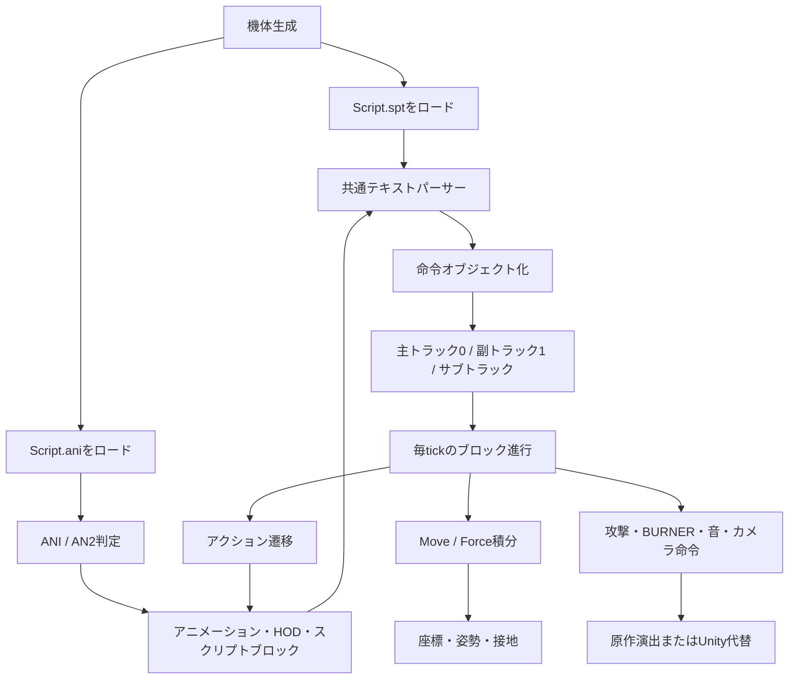

# WindomXP 原作擬似コード実装リファレンス

## この資料の目的

テストプレイモードの実装で毎回 `WindomXP_orig_decompiled.c` 全体を読み直さなくて済むように、原作実行ファイルから確認できた処理を、実装の入口から追える形に整理した資料です。

この資料は擬似コードそのものの代替ではありません。一次資料は常に [WindomXP_orig_decompiled.c](WindomXP_orig_decompiled.c) とし、この資料では次の情報を集約します。

- 機能ごとの入口関数と擬似コード上の行位置
- 実装時に必要な処理順と状態遷移
- 原作で直接確認できた値と、推定・Unity側の代替値の分離
- 現行Unity実装・回帰検証・詳細資料への対応付け

対象は2026-08-11に出力したデコンパイル結果です。原作実行ファイルやGhidra解析結果を更新した場合は、ハッシュと行位置を再確認してからこの資料を更新してください。

## 根拠の読み方

| 表記 | 意味 | 実装上の扱い |
| --- | --- | --- |
| **原作確定** | 擬似コードの分岐、固定値、文字列、メモリ書き込み、呼び出し順を直接追跡できる | 原作準拠値として採用できる。ただしUnityの座標系・物理系への変換は別途記録する。 |
| **原作高確度** | 原作コードと実ANI/SPTデータの対応が一致し、用途がほぼ一意になる | 実装候補として採用できる。別のデータで反例がないか確認する。 |
| **原作推定** | 構造体フィールド名や関数の用途を、周辺の使用方法から推定している | 推定であることをコメント・資料・Inspector設定に残す。 |
| **Unity代替** | DirectX9、Win32入力、原作の内部オブジェクトをUnityで置き換えるための実装 | 原作確定値と混ぜず、調整可能な値として保持する。 |

`FUN_...` の名前はGhidraの自動名です。名前から用途を決めず、必ずこの資料の根拠行と一次資料の該当関数を確認してください。

## 1. 解析対象スナップショット

| 項目 | 値 |
| --- | --- |
| 実行ファイル | `WindomXP_orig.exe` |
| SHA-256 | `EC5A09973CD00C1BAB7AD7FE284293C06A415C65378410E31E4534327CCC20C1` |
| アーキテクチャ | x86 little-endian / 32-bit |
| Ghidraベースアドレス | `0x00400000` |
| デコンパイル成功数 | 4,291件 |
| 失敗数 | 0件 |
| 完全性の根拠 | [WindomXP_orig_decompile_report.json](WindomXP_orig_decompile_report.json) の `decompiled_count` / `failed_count` |

レポートのメタデータには `function_count=4532` も記録されていますが、出力ファイルの完全性を判断するときは、実際に擬似コードを書き出した `decompiled_count=4291` を使います。

## 2. 実装時の最短参照ルート

| 調べたいこと | 最初に見る関数・資料 | Unity側の主な対応 |
| --- | --- | --- |
| `Script.ani` が何を読むか | `FUN_0049cd50`、[L71480](WindomXP_orig_decompiled.c#L71480) | `ani2.cs`、`SCRIPT_ANI_REFERENCE.md` |
| 命令文法・引数 | `FUN_0049d8e0`、[L71743](WindomXP_orig_decompiled.c#L71743) | `TestPlayScriptVM.cs`、`AniScriptRuntime.cs` |
| 命令をいつ実行するか | `FUN_004b8030`、`FUN_004b8250`、[L83723](WindomXP_orig_decompiled.c#L83723) | `TestPlayController.cs`、`TestPlayScriptVM.cs` |
| ジャンプが上昇し続ける／入力解放後の下降 | `FUN_004d5b60`、`FUN_004d5ec0`、`FUN_004cd840` | `IntegrateOriginalForceVelocity`、`TestPlayRuntimeVerification.cs` |
| Force・重力・水平減衰 | `FUN_004cd840`、[L92041](WindomXP_orig_decompiled.c#L92041) | `TestPlayController.cs` |
| ステップ方向・終了条件 | `FUN_004d0b70`、`FUN_004d77e0` | `TestPlayController.cs` |
| 銃／サーベル・格闘遷移 | `FUN_004d2030`、`FUN_004d3280`、`FUN_004d8e30`、`FUN_004d9030` | `TestPlayController.cs` |
| 武器・格闘判定の入口 | `ATTACK`、`RunProc2`、`FUN_004d9dd0` | `TestPlayProjectile.cs`、`TestPlayRuntimeEvent.cs` |
| 効果音・画像・カメラ | `Snd`、起動時リソース登録、`FUN_0044f170` | `TestPlayPresentationRuntime.cs`、`TestPlayCameraController.cs` |

詳細な命令表は [SCRIPT_ANI_COMMANDS_ORIGINAL_SPEC.md](SCRIPT_ANI_COMMANDS_ORIGINAL_SPEC.md)、ロード・解析の検証記録は [SCRIPT_ANI_ORIGINAL_DECOMPILED_ANALYSIS.md](SCRIPT_ANI_ORIGINAL_DECOMPILED_ANALYSIS.md) を参照してください。

## 3. 全体の処理モデル



原作は、テキストを毎tick再解釈する構造ではなく、ロード時に命令オブジェクトへ変換し、命令IDのハンドラーを呼び出す構造です。現行のテストプレイVMはこの流れを、Unityで扱える事前解析済み命令列と型付き状態へ置き換えています。

## 4. 関数索引

### 4.1 ロード・パース・実行

| 関数 | 一次資料の位置 | 原作で確認できる役割 |
| --- | --- | --- |
| `FUN_004993b0` | [L70066](WindomXP_orig_decompiled.c#L70066) | 機体フォルダで `Script.spt` の後に `Script.ani` をロードする生成経路。 |
| `FUN_0049b860` | [L70907](WindomXP_orig_decompiled.c#L70907) | 別のキャラクター生成経路。同じく `Script.spt` と `Script.ani` をロードする。 |
| `FUN_0049cd50` | [L71480](WindomXP_orig_decompiled.c#L71480) | 先頭3バイトで `ANI` / `AN2` を判定し、コンテナを読み込む。旧 `ANI` は200スロット固定。 |
| `FUN_0049d8e0` | [L71743](WindomXP_orig_decompiled.c#L71743) | `Script.spt`、AN2初期スクリプト、ANI/AN2ブロックで共有する専用パーサー。 |
| `FUN_004b8030` | [L83723](WindomXP_orig_decompiled.c#L83723) | 1ブロックの命令オブジェクト列を順番に実行し、命令ID別ハンドラーへ分配する。 |
| `FUN_004b8250` | [L83800](WindomXP_orig_decompiled.c#L83800) | 主トラックのブロック選択、残りtick初期化、命令実行。実行前にアニメーションチャンネル値を状態へ書く。 |
| `FUN_004b84d0` | [L83872](WindomXP_orig_decompiled.c#L83872) | サブトラック側のブロック選択と実行。 |
| `FUN_004b66e0` | [L82826](WindomXP_orig_decompiled.c#L82826) | `AttackDelay(slot, ticks)` の待ち時間をスロットへ保存する。 |
| `FUN_004b7090` | [L83255](WindomXP_orig_decompiled.c#L83255) | `Snd(id)` の固定効果音IDを座標付きで再生するハンドラー。 |

### 4.2 移動・アクション・攻撃

| 関数 | 一次資料の位置 | 原作で確認できる役割 |
| --- | --- | --- |
| `FUN_004cd840` | [L92041](WindomXP_orig_decompiled.c#L92041) | Forceを速度へ加算し、水平減衰、倍率、座標更新を行う共通積分。 |
| `FUN_004d0480` | [L92923](WindomXP_orig_decompiled.c#L92923) | 方向コードから前後左右・斜めの移動ベクトルを作る。 |
| `FUN_004d0a10` | [L92978](WindomXP_orig_decompiled.c#L92978) | 目標方向との差を角度として求め、上限角度で制限する。 |
| `FUN_004d0b70` | [L93033](WindomXP_orig_decompiled.c#L93033) | ステップ開始方向を保存し、アクション9/10/11/12を選ぶ。 |
| `FUN_004d2030` | [L93515](WindomXP_orig_decompiled.c#L93515) | 基本アクションを開始する。サーベル形態では+50側のHODを優先し、スクリプトがなければ元IDを使う。 |
| `FUN_004d3280` | [L93809](WindomXP_orig_decompiled.c#L93809) | 格闘入力の方向別アクション、武器切り替えを選ぶ。 |
| `FUN_004d3e60` | [L94004](WindomXP_orig_decompiled.c#L94004) | X入力の押下エッジ、射撃開始、武器形態を処理する。 |
| `FUN_004d40b0` | [L94048](WindomXP_orig_decompiled.c#L94048) | C入力の押下エッジ、格闘開始、攻撃待ちスロットを処理する。 |
| `FUN_004d59f0` | [L94637](WindomXP_orig_decompiled.c#L94637) | ジャンプ開始ID3。完了後に上昇ID7へ進む。 |
| `FUN_004d5b60` | [L94667](WindomXP_orig_decompiled.c#L94667) | 上昇初期。最初の入力・エネルギー処理とY速度上限を行う。 |
| `FUN_004d5ec0` | [L94764](WindomXP_orig_decompiled.c#L94764) | 上昇継続、入力解放、エネルギー枯渇、空中停止・再上昇を処理する。 |
| `FUN_004d68e0` | [L94997](WindomXP_orig_decompiled.c#L94997) | 空中停止・落下遷移・再上昇を処理する。 |
| `FUN_004d6f10` | [L95134](WindomXP_orig_decompiled.c#L95134) | 通常着地更新。完了後は立ちへ遷移する。 |
| `FUN_004d7520` | [L95256](WindomXP_orig_decompiled.c#L95256) | ステップ着地更新。接地後の回復と立ちへの遷移を行う。 |
| `FUN_004d77e0` | [L95332](WindomXP_orig_decompiled.c#L95332) | ステップ中の移動方向、姿勢追従、最短・最長tick、終了条件を処理する。 |
| `FUN_004d8e30` | [L95805](WindomXP_orig_decompiled.c#L95805) | 射撃アクションの完了、接地時6／空中時8への復帰を処理する。 |
| `FUN_004d9030` | [L95848](WindomXP_orig_decompiled.c#L95848) | 格闘の押下エッジ、SwordCancel、攻撃・ブースト・ステップへの遷移を処理する。 |
| `FUN_004d9dd0` | [L96081](WindomXP_orig_decompiled.c#L96081) | 格闘誘導130。移動ゲージ、対象距離、アクション136への遷移を処理する。 |
| `FUN_004de120` | [L97695](WindomXP_orig_decompiled.c#L97695) | ブーストダッシュ22。旋回、継続条件、終了を処理する。 |

## 5. 正規化した原作処理

以下はGhidraの変数名をそのまま移植するためのコードではなく、原作コードの処理順を実装判断用に書き直したものです。

### 5.1 `Script.ani` ロード

**原作確定**（`FUN_0049cd50`）:

```text
loadAni(file):
    signature = readBytes(3)

    if signature == "ANI":
        read fixedBytes(256)             // 構造HOD名
        load legacy HOD
        for animationIndex in 0..199:    // 200件固定
            read fixedBytes(256)         // アニメーション名
            hodCount = readInt32()
            repeat hodCount:
                read fixedBytes(30)      // 旧HOD名
                load legacy HOD
            scriptCount = readInt32()
            repeat scriptCount:
                readInt32()              // ブロック残りtick
                readFloat32()            // HOD補間時間
                length = readInt32()
                parseScript(readBytes(length))
            append sentinel(duration=999999999)

    else if signature == "AN2":
        read fixedBytes(256)              // 構造HOD名
        load HD2 version 0
        animationCount = readInt32()      // 可変件数
        repeat animationCount:
            read fixedBytes(256)         // アニメーション名
            initialLength = readInt32()
            if initialLength > 0:
                parseScript(readBytes(initialLength), scriptIndex=-1)
            hodCount = readInt32()
            repeat hodCount:
                readInt16()               // ファイル名長
                read filename bytes
                load HD2 version 1
            scriptCount = readInt32()
            repeat scriptCount:
                readInt32()              // ブロック残りtick
                readFloat32()            // HOD補間時間
                length = readInt32()
                parseScript(readBytes(length))
            append sentinel(duration=999999999)
```

旧 `ANI` の200件固定と `AN2` の可変件数は、互換実装で混同してはいけません。現行Unityツールは `ANI` / `AN2` / 単体 `HOD` を読み込めますが、保存は `AN2` です。

### 5.2 共通テキストパーサー

**原作確定**（`FUN_0049d8e0`）:

```text
parseScript(text, context):
    while not end:
        skip(space, tab, semicolon)
        if startsWith("'"):
            skipUntilCRLF()              // 行コメント
        else if startsWith("IF"):
            parse lhs, operator, rhs
            operator in {==, >=, <=, !=, >, <}
        else if startsWith("@int[") or startsWith("@float["):
            index = parseIndex()
            require 0 <= index <= 199
            parse assignment in {=, +=, -=, *=, /=}
        else if startsWith("ATTACK"):
            power, down, force, forceY = parseFourArguments()
            emit AttackPow(power)
            emit AttackDownF(down)
            emit AttackForce(force)
            emit AttackForceY(forceY)
        else if token == "BURNER":
            id, output = parseTwoArguments()
            require 0 <= id <= 19
            emit BunerOut(id, output)
        else if token == "BURNER2":
            showError()
            emit nothing
        else:
            parse known command and its command-specific arguments
```

`BURNER2` は名称を認識するものの、このビルドではエラーを出して命令オブジェクトを生成しません。`AttackForceY` と `BunerOut` は入力トークンではなく、`ATTACK` / `BURNER` から内部生成される名前です。原作の捕獲命令名は `CatchLastChara` で、内部クラス名は `Scr_CatchChara` です。

### 5.3 ブロック実行と再実行

**原作確定**（`FUN_004b8030`、`FUN_004b8250`、`FUN_004b84d0`）:

```text
enterBlock(track, blockIndex, channel):
    track.blockIndex = blockIndex
    track.remainingTicks = block.unk
    track.hodTime = block.time
    state.animationChannel = channel   // @int[151] に対応
    reset per-block flags
    executeBlock(track)

executeBlock(track):
    for command in track.commands:
        command.evaluate(sharedState)
        commandId = command.getCommandId()
        handler = handlers[commandId]
        if handler exists:
            result = handler(command, track)
            if result == 2: return stopBlock
            if result == 1: return yieldBlock

updateTrack(track):
    decrement remainingTicks
    if remainingTicks < 1:
        advance to next block
        if next block is sentinel 999999999:
            loop if AnimeLoop else finish
        else:
            enterBlock(track, nextIndex, track.channel)

    if ExecScriptEveryTime is enabled:
        if repeatCounter == 0:
            executeBlock(track)
            repeatCounter = interval
        else:
            repeatCounter -= 1
```

`ExecScriptEveryTime(n)` は、原作処理上は概ね `n + 1` tick周期です。Unityの通常編集プレビュー側の「ブロック入場時に一度だけ」と、テストプレイVMの再実行対応は同じものではありません。

### 5.4 1 tickの時刻基準

**原作確定**（一次資料 [L20467](WindomXP_orig_decompiled.c#L20467) ～ [L20512](WindomXP_orig_decompiled.c#L20512)）:

```text
originalTickIntervalMilliseconds = 16.666666...
```

原作の入力窓、ANI進行、移動、Forceは60Hz基準です。Unityの `Fixed Timestep=0.02` は通常編集プレビューの50Hz仕様であり、原作比較用の `TestPlayController` と同一視しません。

### 5.5 Force・重力・座標積分

**原作確定**（`FUN_004cd840`）:

```text
velocity.x += force.x
velocity.y += force.y
velocity.z += force.z

if airborne:
    velocity.x *= 0.95
    velocity.z *= 0.95
else:
    velocity.x *= 0.90
    velocity.z *= 0.90

if GvEnable and velocity.y > -0.8:
    velocity.y -= 0.013

velocity *= vF_Multi
position += velocity
```

上の処理は [L92269](WindomXP_orig_decompiled.c#L92269) ～ [L92291](WindomXP_orig_decompiled.c#L92291) で確認できます。`Force` は秒単位の加速度ではなく、1 tickごとの速度差分です。上昇更新側では、加算前のY速度を `0.15` に制限してからANIの `Force Y=0.04` または `0.02` を加えます。この上限を方向入力中の空中移動ID4にも適用しないと、入力解放後に下降へ移れないUnity上の永久上昇が発生します。

`STOP` は数値 `0` とは異なり、対象軸の現在速度も停止します。`Force=(0,y,0)` は水平速度を消去しません。

### 5.6 ジャンプ・空中・ブースト

| アクション | 原作更新 | 原作確定の要点 |
| ---: | --- | --- |
| 3 | `FUN_004d59f0` | ジャンプ開始。`Move` / `Force` を停止し、完了後に7へ進む。途中のZ解放で3を中断しない。 |
| 7 | `FUN_004d5b60` → `FUN_004d5ec0` | 最初の区間は `Force Y=0.04`、その後 `0.02`。毎tick移動ゲージ5を消費。最低5tickの上昇を持つ。 |
| 4 | 下半身側ANI | 方向入力中の空中移動。実ANIにも上向きForceがあるため、Unity側では7と同じY上限が必要。 |
| 8 | `FUN_004d68e0` | 空中停止と落下。条件が整えばゲージ80を使って7へ再上昇。 |
| 5 | `FUN_004d6f10` | 通常着地。垂直移動を止め、完了後に0へ戻る。 |
| 6 | `FUN_004d7520` | ステップ着地。接地中のステップ完了から利用する。 |
| 22 | `FUN_004de120` | ブーストダッシュ。開始時にGenerator/5を一度、継続中に毎tick5を消費。 |

ブーストは、入力を全解放しても直ちに止まるわけではありません。原作コードでは、開始後30tickまでは継続し、31tick以降にジャンプキーと方向入力の両方が解放された場合、またはエネルギーが尽きた場合に終了側へ進みます。

### 5.7 ステップ

**原作確定**:

1. `FUN_004d0b70` が入力方向を保存し、開始時の機体前方に対する内積で前・後・左・右を分類する。
2. アクションは前11、後12、左9、右10を選ぶ。
3. `FUN_004d77e0` は保存方向から移動ベクトルを作り、基準前方の `0.3` 倍を加えて正規化する。
4. 姿勢追従は最大3度/tick。
5. 最初の16tick相当は入力変更・解放を無視し、最大61tickで終了する。移動ゲージは毎tick4を消費する。
6. 終了後は、接地中なら6、空中なら8へ遷移する。ステップ開始だけで接地状態を空中へ変更しない。

### 5.8 銃・サーベル・格闘

**原作高確度**:

| 入力・状態 | 選択 |
| --- | --- |
| X押下エッジ、銃形態 | 射撃100。待ちスロット0を確認する。 |
| X押下エッジ、サーベル形態 | 射撃前に切替68があれば銃へ戻る。 |
| C押下エッジ、銃形態 | 切替18があればサーベルへ移る。 |
| C押下エッジ、サーベル形態 | 前130、中立131、左141、右146、後151。 |
| ブースト開始後5tick超のX | 飛行射撃106。 |
| 格闘中のC再押下 | 現在ブロックの `SwordCancel` 先があれば遷移。 |

基本アクションはサーベル形態で元IDに50を加えたHODを優先します。ただし+50側のスクリプト件数が0なら、スクリプトと時間進行は元IDから取得し、HOD姿勢だけ+50側を再生します。これは「移動・ジャンプの命令」と「武器形態の表示」を別チャンネルで維持するための構造です。

## 6. 原作状態と入力の対応表

### 6.1 内部状態テーブル

| 原作側 | 内容 | 確度 | Unity側の扱い |
| --- | --- | --- | --- |
| `@int[100]` / `+0xD20` | Generator現在値 | 原作高確度 | `currentEnergy`。移動・ブースト系ゲージとして扱う。 |
| `@int[101]` / `+0xD1C` | Generator最大値 | 原作高確度 | `maximumEnergy`。 |
| `@int[102]` / `+0xD2C` | Energy現在値 | 原作高確度 | `currentAuxiliaryEnergy`。 |
| `@int[103]` / `+0xD30` | Energy最大値 | 原作高確度 | `maximumAuxiliaryEnergy`。 |
| `@int[150]` / `+0xBA8` | 接地／空中フラグ | 原作高確度 | `airborneFlag`。Unity接地判定と同期する。 |
| `@int[151]` / `+0xAAC` | ANI実行チャンネル | 原作確定 | 基本アクションの主0・副1を分ける。 |
| `+0xBB0` | 銃／サーベル形態候補 | 原作高確度 | `weaponMode`。用途名は推定であることを維持する。 |

原作の構造体オフセットはUnity側の公開API名ではありません。新しいコードでオフセットを直接再現するのではなく、`TestPlayStateTable` の意味付き状態へ対応させてください。

### 6.2 入力

| 原作状態 | 現行テストプレイの入力 | 内容 |
| --- | --- | --- |
| `@int[190]` | 矢印キー | テンキー方向。前8、後2、左4、右6、斜め1/3/7/9。 |
| `@int[191]` | Z | ジャンプ／ブースト入力。 |
| `@int[192]` | X | 射撃。押下エッジで開始。 |
| `@int[193]` | C | 格闘。押下エッジで開始。 |
| `@int[194]` | V | 防御。 |
| `@int[195]` | S | ロック取得／解除。 |
| `@int[196]`～`@int[198]` | A / D / F | サブ攻撃。 |

原作側は入力状態と押下済み状態を別バイトで保持します。X/Cを保持しているだけで自動連射しない点、解放後の再押下が必要な点を、入力バグ調査時に必ず確認してください。

## 7. 命令別の確定事項と未確定事項

| 命令 | 原作から確定できること | まだ固定しないこと |
| --- | --- | --- |
| `IF` | 6比較演算子、`ELSE` / `ENDIF` の構文 | 複雑な式や一般的なSquirrel互換性。 |
| `@int` / `@float` | 各0～199、`=` / `+=` / `-=` / `*=` / `/=` | 全インデックスの意味。状態表・実データとの照合が必要。 |
| `ATTACK` | 4引数を `AttackPow`、`AttackDownF`、`AttackForce`、`AttackForceY` へ展開 | `AttackFlag` の全ビット意味、命中を発生させるタイミング。 |
| `BURNER` | `BURNER(id, output)`、ID0～19、有効フラグと出力値 | `BURNERSET`末尾引数の原作側の利用先。 |
| `RunProc` / `RunProc2` | 武器・エフェクト生成系の命令名と一部タイプ番号 | タイプ別の全引数、判定形状、寿命、対象選択。 |
| `RunProc2(...,55,...)` | 実データでサーベル表示に使われる | 表示の全パラメータ。 |
| `RunProc2(...,57,...)` | 実データで格闘判定に使われる | ボーン形状、持続tick、多段条件。 |
| `Snd` | 固定ID0～20、97～99とファイル名の対応 | 21～96への割り当て。 |
| `CamEffect` | カメラ効果の命令として処理される | 値ごとの厳密な演出式。 |
| 初期スクリプト | AN2のアニメーション単位に別リストとして格納される | 全生成経路での実行タイミング。 |

未知命令・未知変数・未知引数は削除しません。原作パーサーが認識することと、現行Unityで完全に再現できることは別なので、未実装部分は警告・記録・受け皿の順で扱います。

## 8. Unity側の対応と境界

| Unityファイル | この資料で対応する責務 | 境界 |
| --- | --- | --- |
| `Assets/Scripts/TestPlay/TestPlayController.cs` | 60Hz tick、入力ラッチ、アクション、HOD、移動・Force、簡易戦闘 | 原作の内部オブジェクトをUnity状態へ置き換える。 |
| `Assets/Scripts/TestPlay/TestPlayScriptVM.cs` | IF、変数、代入、命令列、`ExecScriptEveryTime` | 原作の全命令ハンドラーを網羅するものではない。 |
| `Assets/Scripts/TestPlay/TestPlayStateTable.cs` | `@int` / `@float` 相当の状態 | 原作オフセットを直接公開しない。 |
| `Assets/Scripts/TestPlay/TestPlayCameraController.cs` | ロック、追従、障害物回避、`CamEffect`近似 | 原作カメラの厳密な配置式は未確定。Inspector調整値を残す。 |
| `Assets/Scripts/TestPlay/TestPlayPresentationRuntime.cs` | `Snd`、`Voice`、テクスチャ、イベント | DirectX9の描画・音源をUnity演出へ置き換える。 |
| `Assets/Scripts/AniScriptRuntime.cs` | 通常の編集プレビューでのANI命令受け皿 | テストプレイVMとは互換範囲・tick目的が異なる。 |
| `Assets/Editor/TestPlayRuntimeVerification.cs` | 原作確定値の回帰検証 | 期待値は `Time.fixedDeltaTime` など実行環境から導出し、状態を各ケースで復元する。 |

原作のカメラ更新関数 `FUN_0044f170` は [L38758](WindomXP_orig_decompiled.c#L38758) 付近です。投影生成には垂直FOV60度と近面0.1が確認できますが、配置・注視点の全式は未特定です。したがって `TestPlayCameraController` の追従・回避・揺れはUnity代替として扱います。

## 9. 実装・調査の手順

1. 変更したい挙動を、入力・ANI命令・状態・物理積分・完了遷移に分解する。
2. この資料の関数索引から原作関数へ戻り、一次資料の分岐と固定値を確認する。
3. 実際の `Script.ani` / `Script.spt` で、対象アクションと命令列を確認する。
4. **原作確定**、**原作高確度**、**原作推定**、**Unity代替**のどれかを実装コメントと資料へ記録する。
5. `TestPlayController` の状態遷移、入力解放境界、重力／接地判定の順序を回帰検証する。
6. 詳細な命令仕様を更新した場合は [SCRIPT_ANI_ORIGINAL_DECOMPILED_ANALYSIS.md](SCRIPT_ANI_ORIGINAL_DECOMPILED_ANALYSIS.md) と [SCRIPT_ANI_COMMANDS_ORIGINAL_SPEC.md](SCRIPT_ANI_COMMANDS_ORIGINAL_SPEC.md) の該当箇所も同期する。

特に「入力を離したのに動き続ける」問題では、入力フラグだけを見ず、次の順で確認します。

```text
入力解放
  -> 該当ANIブロックが停止したか
  -> Move / Force / STOP の状態がどうなったか
  -> velocityへの積分順と上限・減衰
  -> 接地／空中フラグ
  -> 重力が有効になったか
  -> 次のアクションへ遷移したか
```

## 10. 既知の未解決事項

- `RunProc`、`RunProc2`、`WeaponAttack*` のタイプ別パラメータの完全な意味。
- type57格闘判定のボーン別形状、持続tick、多段ヒット、対象選択。
- 初期スクリプトの全生成経路での実行タイミング。
- `Script.ani` 内部HODの暗号・変換境界。
- `BURNERSET` 第4引数が原作側で実際に利用されるか。
- 文字列テーブルに存在する全命令と、命令ID別ハンドラーの完全な対応。
- 原作カメラの配置・注視点・`CamEffect`値ごとの厳密な演出。

これらを実装するときは、命令名や既存コミュニティ資料だけで確定扱いせず、一次資料の追加追跡と実データ比較を行います。

## 関連資料

- [SCRIPT_ANI_ORIGINAL_DECOMPILED_ANALYSIS.md](SCRIPT_ANI_ORIGINAL_DECOMPILED_ANALYSIS.md): 関数ごとの詳細な解析記録。
- [SCRIPT_ANI_COMMANDS_ORIGINAL_SPEC.md](SCRIPT_ANI_COMMANDS_ORIGINAL_SPEC.md): 命令、アクション番号、武器・エフェクト番号の仕様メモ。
- [SCRIPT_ANI_REFERENCE.md](SCRIPT_ANI_REFERENCE.md): Unityツールの `Script.ani` 読み書きと編集プレビュー。
- [TEST_PLAY_MODE.md](TEST_PLAY_MODE.md): 現行テストプレイの実装範囲、入力、回帰検証。
- [PROJECT_REFERENCE.md](PROJECT_REFERENCE.md): プロジェクト全体の構造・データ形式・変更リスク。
- [WindomXP_orig_decompiled.c](WindomXP_orig_decompiled.c): 4,291関数の一次擬似コード。
