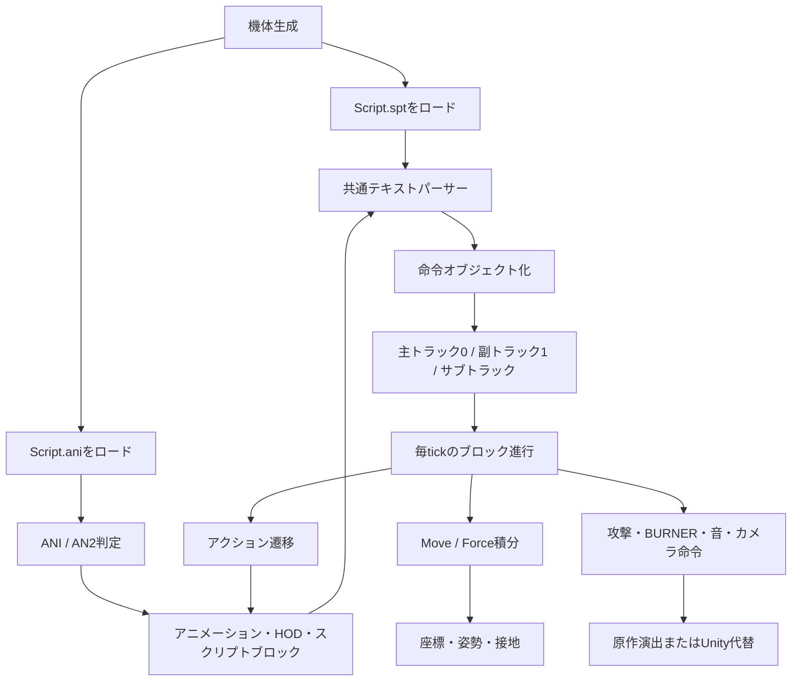

# WindomXP 原作擬似コード実装リファレンス

## この資料の目的

テストプレイモードの実装で毎回 `WindomXP_orig_decompiled.c` 全体を読み直さなくて済むように、原作実行ファイルから確認できた処理を、実装の入口から追える形に整理した資料です。

この資料は擬似コードそのものの代替ではありません。一次資料は常に [WindomXP_orig_decompiled.c](WindomXP_orig_decompiled.c) とし、この資料では次の情報を集約します。

- 機能ごとの入口関数と擬似コード上の行位置
- 実装時に必要な処理順と状態遷移
- 原作で直接確認できた値と、推定・Unity側の代替値の分離
- 現行Unity実装・回帰検証・詳細資料への対応付け

対象は2026-08-11に出力したデコンパイル結果です。原作実行ファイルやGhidra解析結果を更新した場合は、ハッシュと行位置を再確認してからこの資料を更新してください。

## 根拠の読み方

| 表記 | 意味 | 実装上の扱い |
| --- | --- | --- |
| **原作確定** | 擬似コードの分岐、固定値、文字列、メモリ書き込み、呼び出し順を直接追跡できる | 原作準拠値として採用できる。ただしUnityの座標系・物理系への変換は別途記録する。 |
| **原作高確度** | 原作コードと実ANI/SPTデータの対応が一致し、用途がほぼ一意になる | 実装候補として採用できる。別のデータで反例がないか確認する。 |
| **原作推定** | 構造体フィールド名や関数の用途を、周辺の使用方法から推定している | 推定であることをコメント・資料・Inspector設定に残す。 |
| **Unity代替** | DirectX9、Win32入力、原作の内部オブジェクトをUnityで置き換えるための実装 | 原作確定値と混ぜず、調整可能な値として保持する。 |

`FUN_...` の名前はGhidraの自動名です。名前から用途を決めず、必ずこの資料の根拠行と一次資料の該当関数を確認してください。

## 1. 解析対象スナップショット

| 項目 | 値 |
| --- | --- |
| 実行ファイル | `WindomXP_orig.exe` |
| SHA-256 | `EC5A09973CD00C1BAB7AD7FE284293C06A415C65378410E31E4534327CCC20C1` |
| アーキテクチャ | x86 little-endian / 32-bit |
| Ghidraベースアドレス | `0x00400000` |
| デコンパイル成功数 | 4,291件 |
| 失敗数 | 0件 |
| 完全性の根拠 | [WindomXP_orig_decompile_report.json](WindomXP_orig_decompile_report.json) の `decompiled_count` / `failed_count` |

レポートのメタデータには `function_count=4532` も記録されていますが、出力ファイルの完全性を判断するときは、実際に擬似コードを書き出した `decompiled_count=4291` を使います。

## 2. 実装時の最短参照ルート

| 調べたいこと | 最初に見る関数・資料 | Unity側の主な対応 |
| --- | --- | --- |
| `Script.ani` が何を読むか | `FUN_0049cd50`、[L71480](WindomXP_orig_decompiled.c#L71480) | `ani2.cs`、`SCRIPT_ANI_REFERENCE.md` |
| 命令文法・引数 | `FUN_0049d8e0`、[L71743](WindomXP_orig_decompiled.c#L71743) | `TestPlayScriptVM.cs`、`AniScriptRuntime.cs` |
| 命令をいつ実行するか | `FUN_004b8030`、`FUN_004b8250`、[L83723](WindomXP_orig_decompiled.c#L83723) | `TestPlayController.cs`、`TestPlayScriptVM.cs` |
| ジャンプが上昇し続ける／入力解放後の下降 | `FUN_004d5b60`、`FUN_004d5ec0`、`FUN_004cd840` | `IntegrateOriginalForceVelocity`、`TestPlayRuntimeVerification.cs` |
| Force・重力・水平減衰 | `FUN_004cd840`、[L92041](WindomXP_orig_decompiled.c#L92041) | `TestPlayController.cs` |
| ステップ方向・終了条件 | `FUN_004d0b70`、`FUN_004d77e0` | `TestPlayController.cs` |
| 銃／サーベル・格闘遷移 | `FUN_004d2030`、`FUN_004d3280`、`FUN_004d8e30`、`FUN_004d9030` | `TestPlayController.cs` |
| 武器・格闘判定の入口 | `ATTACK`、`RunProc2`、`FUN_004d9dd0` | `TestPlayProjectile.cs`、`TestPlayRuntimeEvent.cs` |
| 効果音・画像・カメラ | `Snd`、起動時リソース登録、`FUN_0044f170` | `TestPlayPresentationRuntime.cs`、`TestPlayCameraController.cs` |

詳細な命令表は [SCRIPT_ANI_COMMANDS_ORIGINAL_SPEC.md](SCRIPT_ANI_COMMANDS_ORIGINAL_SPEC.md)、ロード・解析の検証記録は [SCRIPT_ANI_ORIGINAL_DECOMPILED_ANALYSIS.md](SCRIPT_ANI_ORIGINAL_DECOMPILED_ANALYSIS.md) を参照してください。

## 3. 全体の処理モデル



原作は、テキストを毎tick再解釈する構造ではなく、ロード時に命令オブジェクトへ変換し、命令IDのハンドラーを呼び出す構造です。現行のテストプレイVMはこの流れを、Unityで扱える事前解析済み命令列と型付き状態へ置き換えています。

## 4. 関数索引

### 4.1 ロード・パース・実行

| 関数 | 一次資料の位置 | 原作で確認できる役割 |
| --- | --- | --- |
| `FUN_004993b0` | [L70066](WindomXP_orig_decompiled.c#L70066) | 機体フォルダで `Script.spt` の後に `Script.ani` をロードする生成経路。 |
| `FUN_0049b860` | [L70907](WindomXP_orig_decompiled.c#L70907) | 別のキャラクター生成経路。同じく `Script.spt` と `Script.ani` をロードする。 |
| `FUN_0049cd50` | [L71480](WindomXP_orig_decompiled.c#L71480) | 先頭3バイトで `ANI` / `AN2` を判定し、コンテナを読み込む。旧 `ANI` は200スロット固定。 |
| `FUN_0049d8e0` | [L71743](WindomXP_orig_decompiled.c#L71743) | `Script.spt`、AN2初期スクリプト、ANI/AN2ブロックで共有する専用パーサー。script index `-1`はアニメーションレコード`+0x0C`の別vector、通常block命令はblock record `+0x08`へ格納する。 |
| `FUN_00499d50` | [L70260](WindomXP_orig_decompiled.c#L70260) | `GUNFILENAME`／`SWORDFILENAME`を外部ロードせず、読込済みHOD階層のノードへ名前解決する。 |
| `FUN_00571230`／`FUN_00571250` | [L163127](WindomXP_orig_decompiled.c#L163127) | HODノード名を最大10子ずつ再帰検索する。 |
| `FUN_00572c50` | [L164229](WindomXP_orig_decompiled.c#L164229) | ノード表示byteを最大10子ずつ再帰設定する。GameObject相当の寿命制御ではない。 |
| `FUN_004b8030` | [L83723](WindomXP_orig_decompiled.c#L83723) | 1ブロックの命令オブジェクト列を順番に実行し、命令ID別ハンドラーへ分配する。 |
| `FUN_004b8250` | [L83800](WindomXP_orig_decompiled.c#L83800) | 主トラックのtimed block選択、残りtick初期化、命令実行。実行前にアニメーションチャンネル値を状態へ書く。AN2初期vector `+0x0C`は参照しない。 |
| `FUN_004b84d0` | [L83872](WindomXP_orig_decompiled.c#L83872) | サブトラック側のブロック選択と実行。 |
| `FUN_004b66e0` | [L82826](WindomXP_orig_decompiled.c#L82826) | `AttackDelay(slot, ticks)` の待ち時間をスロットへ保存する。 |
| `FUN_004b7090` | [L83255](WindomXP_orig_decompiled.c#L83255) | `Snd(id)` の固定効果音IDを座標付きで再生するハンドラー。 |

### 4.2 移動・アクション・攻撃

| 関数 | 一次資料の位置 | 原作で確認できる役割 |
| --- | --- | --- |
| `FUN_00498260` | [L69355](WindomXP_orig_decompiled.c#L69355) | type 57判定の前tick行列保存と寿命減算を行う継承更新。 |
| `FUN_00495750` | [L68274](WindomXP_orig_decompiled.c#L68274) | type 57を含む命中対象nodeの残りtickを1ずつ減らし、1未満でnodeを削除する。 |
| `FUN_004b27a0` | [L81313](WindomXP_orig_decompiled.c#L81313) | type 57の現在・前tick線分から掃引面を作り、対象衝突と命中済み対象を処理する。 |
| `FUN_004b74a0` | [L83367](WindomXP_orig_decompiled.c#L83367) | `RunProc2`引数を評価し、proc type別テーブルへdispatchする。 |
| `FUN_004fa830` | [L106499](WindomXP_orig_decompiled.c#L106499) | RunProc2 type 62。第4引数のsubtype 0～11を個別factoryへdispatchする。 |
| `FUN_0048bdf0` | [L63907](WindomXP_orig_decompiled.c#L63907) | type 62 subtype 2が使う`BB_WindRing` factory。base constructor後に`BB_WindRing::vftable`を設定する。 |
| `FUN_0048bef0` | [L63949](WindomXP_orig_decompiled.c#L63949) | `BB_WindRing`初期化。位置、size 1.0、draw mode 1、texture、色、growth 0.3、signed alpha delta -24を保持する。 |
| `FUN_0048d5d0` | [L64944](WindomXP_orig_decompiled.c#L64944) | `BB_WindRing`描画。保持行列、quad頂点、texture、draw modeを描画経路へ渡す。 |
| `FUN_00491af0` | [L66748](WindomXP_orig_decompiled.c#L66748) | `BB_WindRing`更新。sizeを0.3増やした後alphaを24減らし、候補alphaが負なら終了する。subtype 2ではowner／追従pointerが設定されない。 |
| `FUN_00503600` | [L111132](WindomXP_orig_decompiled.c#L111132) | type 62 subtype 6の非戦闘`BB_Hinoko` objectを生成する。RTTI／primary vtableも同クラスへ対応する。 |
| `FUN_005036e0` | [L111173](WindomXP_orig_decompiled.c#L111173) | `BB_Hinoko`を行列、size、前進量、`hinoko.png`、色で初期化し、alpha 255・elapsed 0・draw値0と生成時乱数回転を設定する。 |
| `FUN_0048e0b0` | [L65306](WindomXP_orig_decompiled.c#L65306) | `BB_Hinoko`更新。local Z前進、共有乱数による前進量／X-Y基底変化、alpha反映、draw値+5、elapsed加算を行い、更新31からalphaを4ずつ減らして更新94で終了する。 |
| `FUN_0048e3a0` | [L65365](WindomXP_orig_decompiled.c#L65365) | `BB_Hinoko`描画。size、行列、texture、更新で蓄積したdraw値をDX9描画経路へ渡す。戦闘判定処理ではない。 |
| `FUN_005028f0` | [L110583](WindomXP_orig_decompiled.c#L110583) | type 62 subtype 8の非戦闘`LZ_MagicShieldEffect` objectを生成する。 |
| `FUN_00479120` | [L55510](WindomXP_orig_decompiled.c#L55510) | subtype 8をWEAPONPOINT行列、model slot、release gate、追従flag兼countdownで初期化する。 |
| `FUN_00479370` | [L55587](WindomXP_orig_decompiled.c#L55587) | subtype 8のscale／opacityを0.1ずつ増やし、scale 0.9でactive更新へ切り替える。 |
| `FUN_00479560` | [L55639](WindomXP_orig_decompiled.c#L55639) | subtype 8のactive更新。行列追従、opacity増加、countdown先行減算、fade遷移を行う。 |
| `FUN_00479740` | [L55688](WindomXP_orig_decompiled.c#L55688) | subtype 8のfade更新。opacityを0.1減らし、残存中scaleを0.05増やし、終了を返す。 |
| `FUN_004f99f0` | [L106090](WindomXP_orig_decompiled.c#L106090) | RunProc type 53。`BB_WindLine`を7個生成し、各軸±1.5の散布と0.07／3.0を渡す。proc引数objectは受け取らない。 |
| `FUN_004f9ba0` | [L106142](WindomXP_orig_decompiled.c#L106142) | RunProc type 54。`BB_WindRing2`を1個生成する。proc引数objectは受け取らない。 |
| `FUN_004f9d00` | [L106183](WindomXP_orig_decompiled.c#L106183) | RunProc2 type 55。WEAPONPOINT、目標／初期長、2 texture、管理slot置換、寿命を`BB_SwordBeam`生成へ渡す。 |
| `FUN_004cd840` | [L92041](WindomXP_orig_decompiled.c#L92041) | Forceを速度へ加算し、水平減衰、倍率、座標更新を行う共通積分。 |
| `FUN_004d0480` | [L92923](WindomXP_orig_decompiled.c#L92923) | 方向コードから前後左右・斜めの移動ベクトルを作る。 |
| `FUN_004d0a10` | [L92978](WindomXP_orig_decompiled.c#L92978) | 目標方向との差を角度として求め、上限角度で制限する。 |
| `FUN_004d0b70` | [L93033](WindomXP_orig_decompiled.c#L93033) | ステップ開始方向を保存し、アクション9/10/11/12を選ぶ。 |
| `FUN_004d2030` | [L93515](WindomXP_orig_decompiled.c#L93515) | 基本アクションを開始する。サーベル形態では+50側のHODを優先し、スクリプトがなければ元IDを使う。 |
| `FUN_004d3280` | [L93809](WindomXP_orig_decompiled.c#L93809) | 格闘入力の方向別アクション、武器切り替えを選ぶ。 |
| `FUN_004d3e60` | [L94004](WindomXP_orig_decompiled.c#L94004) | X入力の押下エッジ、射撃開始、武器形態を処理する。 |
| `FUN_004d40b0` | [L94048](WindomXP_orig_decompiled.c#L94048) | C入力の押下エッジ、格闘開始、攻撃待ちスロットを処理する。 |
| `FUN_004d59f0` | [L94637](WindomXP_orig_decompiled.c#L94637) | ジャンプ開始ID3。完了後に上昇ID7へ進む。 |
| `FUN_004d5b60` | [L94667](WindomXP_orig_decompiled.c#L94667) | 上昇初期。最初の入力・エネルギー処理とY速度上限を行う。 |
| `FUN_004d5ec0` | [L94764](WindomXP_orig_decompiled.c#L94764) | 上昇継続、入力解放、エネルギー枯渇、空中停止・再上昇を処理する。 |
| `FUN_004d68e0` | [L94997](WindomXP_orig_decompiled.c#L94997) | 空中停止・落下遷移・再上昇を処理する。 |
| `FUN_004d6f10` | [L95134](WindomXP_orig_decompiled.c#L95134) | 通常着地更新。完了後は立ちへ遷移する。 |
| `FUN_004d7520` | [L95256](WindomXP_orig_decompiled.c#L95256) | ステップ着地更新。接地後の回復と立ちへの遷移を行う。 |
| `FUN_004d77e0` | [L95332](WindomXP_orig_decompiled.c#L95332) | ステップ中の移動方向、姿勢追従、最短・最長tick、終了条件を処理する。 |
| `FUN_004d8e30` | [L95805](WindomXP_orig_decompiled.c#L95805) | 射撃アクションの完了、接地時6／空中時8への復帰を処理する。 |
| `FUN_004d9030` | [L95848](WindomXP_orig_decompiled.c#L95848) | 格闘の押下エッジ、SwordCancel、攻撃・ブースト・ステップへの遷移を処理する。 |
| `FUN_004d9dd0` | [L96081](WindomXP_orig_decompiled.c#L96081) | 格闘誘導130。移動ゲージ、対象距離、アクション136への遷移を処理する。 |
| `FUN_004de120` | [L97695](WindomXP_orig_decompiled.c#L97695) | ブーストダッシュ22。旋回、継続条件、終了を処理する。 |
| `FUN_004e8310` | [L100800](WindomXP_orig_decompiled.c#L100800) | RunProc2 type 1を処理し、energy、WEAPONPOINT、trail、移動、幅、誘導、textureを`LZ_Beam`へ渡す。 |
| `FUN_004600c0` | [L55261](WindomXP_orig_decompiled.c#L55261) | type 1を初期化し、生成時ATTACK snapshotと固定300 active tickを保持する。 |
| `FUN_00460200` | [L55364](WindomXP_orig_decompiled.c#L55364) | type 1をp2/100前進後にtargetへ旋回し、active tickとtrailを更新する。 |
| `FUN_0045e610` | [L54409](WindomXP_orig_decompiled.c#L54409) | type 1 trail線分を対象側複合形状へ照合し、同一対象の重複命中を抑止する。 |
| `FUN_004fa150` | [L106308](WindomXP_orig_decompiled.c#L106308) | proc type 57のWEAPONPOINT、長さ、hit-stop、対象別再命中interval、寿命を判定生成へ渡す。 |
| `FUN_00502b00` | [L110673](WindomXP_orig_decompiled.c#L110673) | type 55の非戦闘`BB_SwordBeam` objectを生成する。 |
| `FUN_00502bd0` | [L110712](WindomXP_orig_decompiled.c#L110712) | type 57の`BB_SwordBeamAtk`相当objectを生成する。 |
| `FUN_00502cb0` | [L110752](WindomXP_orig_decompiled.c#L110752) | type 55を初期化し、WEAPONPOINT、長さ、2 texture、寿命、幅0.075を保持する。 |
| `FUN_00502e60` | [L110804](WindomXP_orig_decompiled.c#L110804) | type 57判定を初期化し、`p2` hit-stop、`p3`対象別再命中interval、`p8`寿命と生成時ATTACKプロファイルを複製する。 |
| `FUN_00497cd0` | [L69202](WindomXP_orig_decompiled.c#L69202) | type 55をWEAPONPOINTへ追従させ、有限寿命を減算し、長さを0.2/tickで目標まで伸ばす。 |

## 5. 正規化した原作処理

以下はGhidraの変数名をそのまま移植するためのコードではなく、原作コードの処理順を実装判断用に書き直したものです。

### 5.1 `Script.ani` ロード

**原作確定**（`FUN_0049cd50`）:

```text
loadAni(file):
    signature = readBytes(3)

    if signature == "ANI":
        read fixedBytes(256)             // 構造HOD名
        load legacy HOD
        for animationIndex in 0..199:    // 200件固定
            read fixedBytes(256)         // アニメーション名
            hodCount = readInt32()
            repeat hodCount:
                read fixedBytes(30)      // 旧HOD名
                load legacy HOD
            scriptCount = readInt32()
            repeat scriptCount:
                readInt32()              // ブロック残りtick
                readFloat32()            // HOD補間時間
                length = readInt32()
                parseScript(readBytes(length))
            append sentinel(duration=999999999)

    else if signature == "AN2":
        read fixedBytes(256)              // 構造HOD名
        load HD2 version 0
        animationCount = readInt32()      // 可変件数
        repeat animationCount:
            read fixedBytes(256)         // アニメーション名
            initialLength = readInt32()
            if initialLength > 0:
                parseScript(readBytes(initialLength), scriptIndex=-1)
            hodCount = readInt32()
            repeat hodCount:
                readInt16()               // ファイル名長
                read filename bytes
                load HD2 version 1
            scriptCount = readInt32()
            repeat scriptCount:
                readInt32()              // ブロック残りtick
                readFloat32()            // HOD補間時間
                length = readInt32()
                parseScript(readBytes(length))
            append sentinel(duration=999999999)
```

旧 `ANI` の200件固定と `AN2` の可変件数は、互換実装で混同してはいけません。現行Unityツールは `ANI` / `AN2` / 単体 `HOD` を読み込めますが、保存は `AN2` です。

### 5.2 共通テキストパーサー

**原作確定**（`FUN_0049d8e0`）:

```text
parseScript(text, context):
    while not end:
        skip(space, tab, semicolon)
        if startsWith("'"):
            skipUntilCRLF()              // 行コメント
        else if startsWith("IF"):
            parse lhs, operator, rhs
            operator in {==, >=, <=, !=, >, <}
        else if startsWith("@int[") or startsWith("@float["):
            index = parseIndex()
            require 0 <= index <= 199
            parse assignment in {=, +=, -=, *=, /=}
        else if startsWith("ATTACK"):
            power, down, force, forceY = parseFourArguments()
            emit AttackPow(power)
            emit AttackDownF(down)
            emit AttackForce(force)
            emit AttackForceY(forceY)
        else if token == "BURNER":
            id, output = parseTwoArguments()
            require 0 <= id <= 19
            emit BunerOut(id, output)
        else if token == "BURNER2":
            showError()
            emit nothing
        else:
            parse known command and its command-specific arguments
```

`BURNER2` は名称を認識するものの、このビルドではエラーを出して命令オブジェクトを生成しません。`AttackForceY` と `BunerOut` は入力トークンではなく、`ATTACK` / `BURNER` から内部生成される名前です。原作の捕獲命令名は `CatchLastChara` で、内部クラス名は `Scr_CatchChara` です。

### 5.3 ブロック実行と再実行

**原作確定**（`FUN_004b8030`、`FUN_004b8250`、`FUN_004b84d0`）:

```text
enterBlock(track, blockIndex, channel):
    track.blockIndex = blockIndex
    track.remainingTicks = block.unk
    track.hodTime = block.time
    state.animationChannel = channel   // @int[151] に対応
    reset per-block flags
    executeBlock(track)

executeBlock(track):
    for command in track.commands:
        command.evaluate(sharedState)
        commandId = command.getCommandId()
        handler = handlers[commandId]
        if handler exists:
            result = handler(command, track)
            if result == 2: return stopBlock
            if result == 1: return yieldBlock

updateTrack(track):
    decrement remainingTicks
    if remainingTicks < 1:
        advance to next block
        if next block is sentinel 999999999:
            loop if AnimeLoop else finish
        else:
            enterBlock(track, nextIndex, track.channel)

    if ExecScriptEveryTime is enabled:
        if repeatCounter == 0:
            executeBlock(track)
            repeatCounter = interval
        else:
            repeatCounter -= 1
```

`ExecScriptEveryTime(n)` は、原作処理上は概ね `n + 1` tick周期です。Unityの通常編集プレビュー側の「ブロック入場時に一度だけ」と、テストプレイVMの再実行対応は同じものではありません。

### 5.4 1 tickの時刻基準

**原作確定**（一次資料 [L20467](WindomXP_orig_decompiled.c#L20467) ～ [L20512](WindomXP_orig_decompiled.c#L20512)）:

```text
originalTickIntervalMilliseconds = 16.666666...
```

原作の入力窓、ANI進行、移動、Forceは60Hz基準です。Unityの `Fixed Timestep=0.02` は通常編集プレビューの50Hz仕様であり、原作比較用の `TestPlayController` と同一視しません。

### 5.5 Force・重力・座標積分

**原作確定**（`FUN_004cd840`）:

```text
velocity.x += force.x
velocity.y += force.y
velocity.z += force.z

if airborne:
    velocity.x *= 0.95
    velocity.z *= 0.95
else:
    velocity.x *= 0.90
    velocity.z *= 0.90

if GvEnable and velocity.y > -0.8:
    velocity.y -= 0.013

velocity *= vF_Multi

move *= actionMoveRetention
position += transformByMovementHeading(move)
position += velocity
```

Forceと重力の処理は [L92269](WindomXP_orig_decompiled.c#L92269) ～ [L92291](WindomXP_orig_decompiled.c#L92291)、Moveの保持率と位置加算は [L92378](WindomXP_orig_decompiled.c#L92378) ～ [L92416](WindomXP_orig_decompiled.c#L92416) で確認できます。`Force` は秒単位の加速度ではなく、1 tickごとの速度差分です。上昇更新側では、加算前のY速度を `0.15` に制限してからANIの `Force Y=0.04` または `0.02` を加えます。この上限を方向入力中の空中移動ID4にも適用しないと、入力解放後に下降へ移れないUnity上の永久上昇が発生します。

Moveの保持率はaction開始関数`FUN_004d2030`が引数から`+0xA88`へ保存します。通常移動action 1は`1.0`、`FUN_004d5420`が入力解放から開始する待機action 0は`0.8`です。`FUN_004cd840`はこの値をMove `+0xAD0/+0xAD4/+0xAD8`へ同tick内で乗算してから位置へ加えます。したがって解放tickの関数入口Moveが`0.08`なら、位置更新へ使う乗算後Moveは`0.064`です。現在のPhase 6A原作traceは関数入口の乗算前Moveを記録しているため、Unityの要求変位用`scriptedVelocity`と同義にせず、Phase 6Bで適用前／適用後を分けて比較します。

追加のx32dbg実機観測では、`Logs/WindomXP/WindomXP_orig.exe`の自機`ECX=0x12E2D020`について、前進入口の`dir=8 / Move Z=0.08 / +0xA88=1.0`、解放入口の`dir=5 / Move Z=0.08 / +0xA88=0.8`を確認しました。乗算命令列の後に、解放tickの`[ECX+0xAD8]=0x3D83126F`（`0.064`）を実メモリで確認し、後段停止点`0x004CDFC4`のログで対象機の適用後`Move Z=0.04096`も取得しました。これは既存schema v1を置換するものではなく、schema v2全tick化前の部分観測です。生ログは[`log-20260823-074558.txt`](../Logs/OriginalTraceTools/x64dbg-2026.05.27/release/x32/log-20260823-074558.txt)です。

`STOP` は数値 `0` とは異なり、対象軸の現在速度も停止します。`Force=(0,y,0)` は水平速度を消去しません。

### 5.6 ジャンプ・空中・ブースト

| アクション | 原作更新 | 原作確定の要点 |
| ---: | --- | --- |
| 3 | `FUN_004d59f0` | ジャンプ開始。`Move` / `Force` を停止し、完了後に7へ進む。途中のZ解放で3を中断しない。 |
| 7 | `FUN_004d5b60` → `FUN_004d5ec0` | 最初の区間は `Force Y=0.04`、その後 `0.02`。毎tick移動ゲージ5を消費。最低5tickの上昇を持つ。 |
| 4 | 下半身側ANI | 方向入力中の空中移動。実ANIにも上向きForceがあるため、Unity側では7と同じY上限が必要。 |
| 8 | `FUN_004d68e0` | 空中停止と落下。継承Moveの保持率は`0.99`。`c38 < 31`・移動ゲージ正・Y速度`< 0.05`では共通重力前にY速度へ`+0.012`する。条件が整えばゲージ80を使って7へ再上昇。 |
| 5 | `FUN_004d6f10` | 通常着地。垂直移動を止め、完了後に0へ戻る。 |
| 6 | `FUN_004d7520` | ステップ着地。接地中のステップ完了から利用する。 |
| 22 | `FUN_004de120` | ブーストダッシュ。開始時にGenerator/5を一度、継続中に毎tick5を消費。 |

ブーストは、入力を全解放しても直ちに止まるわけではありません。原作コードでは、開始後30tickまでは継続し、31tick以降にジャンプキーと方向入力の両方が解放された場合、またはエネルギーが尽きた場合に終了側へ進みます。

### 5.7 ステップ

**原作確定**:

1. `FUN_004d0b70` が入力方向を保存し、開始時の機体前方に対する内積で前・後・左・右を分類する。
2. アクションは前11、後12、左9、右10を選ぶ。
3. `FUN_004d77e0` は保存方向から移動ベクトルを作り、基準前方の `0.3` 倍を加えて正規化する。
4. 姿勢追従は最大3度/tick。
5. 最初の16tick相当は入力変更・解放を無視し、最大61tickで終了する。移動ゲージは毎tick4を消費する。
6. 終了後は、接地中なら6、空中なら8へ遷移する。ステップ開始だけで接地状態を空中へ変更しない。

### 5.8 銃・サーベル・格闘

**原作高確度**:

| 入力・状態 | 選択 |
| --- | --- |
| X押下エッジ、銃形態 | 射撃100。待ちスロット0を確認する。 |
| X押下エッジ、サーベル形態 | 射撃前に切替68があれば銃へ戻る。 |
| C押下エッジ、銃形態 | 切替18があればサーベルへ移る。 |
| C押下エッジ、サーベル形態 | 前130、中立131、左141、右146、後151。 |
| ブースト開始後5tick超のX | 飛行射撃106。 |
| 格闘中のC再押下 | 現在ブロックの `SwordCancel` 先があれば遷移。 |

代表ケースGT-007は、`FUN_004d3e60`のX押下エッジとcooldown slot 0、`FUN_004b66e0`の`AttackDelay`、`FUN_004d8e30`の接地復帰を実機体ANIへ結合して検証します。X押下1tickでaction 100へ1回入り、39 action tick、同一tickの`AttackDelay(0,100)`／`ATTACK(100,200,0.4,0)`／`AttackFlag=2`／`RunProc2` type 1発射、cooldown 100→0、action 6→0を確認済みです。入力・待ち・復帰は**原作高確度**、命令値と実行tickは`RealAniObserved`です。type 1のCore速度・trail点数・幅は確定済みですが、表示は通過済み位置だけを結ぶworld-space ribbonというUnity代替で、DX9頂点・UV・fadeは未確定です。`OBS-GT007-20260902-GROUNDED-SHOT-RECOVERY`の原作画面手動観測では、静止射撃後に着地姿勢を挟まず立ちへ移行しました。Unityはaction 100→6→0、action 6の34tick、script実行とtrace上の`Snd(2)` eventを維持し、接地action 100後だけaction 6区間の表示HODを立ちaction先頭poseへ差し替え、`Snd(2)=tyakuti.wav`の実再生を抑止します。2026-09-05の実機体Test Playで、立ち姿勢への直接復帰と同区間の無音をユーザーが目視・聴感受入しました。画面観測はaction入口ログを伴わないため**原作確定**とはせず、表示／音声差し替えはUnity代替です。この検証は原作EXE全tick観測一致を意味しません。

代表ケースGT-008／009は、`FUN_004d3280`／`FUN_004d40b0`の持替え・方向格闘選択、`FUN_004d9dd0`の誘導130→136、`FUN_004d9030`のC入力queueと`SwordCancel`を実機体ANIへ結合して検証します。GT-008はaction 18の21tick後にSword idleへ戻り、方向8＋Cから130を6tick・5/tick消費して136へ進みます。GT-009はtick 12／33のC入力を保持し、`SwordCancel=132/133`が有効になった次tickに131→132→133へ進みます。これらの選択・消費・遷移は**原作高確度**、action期間、攻撃値、type 55／57命令発火tickは`RealAniObserved`です。単一TargetDummyに対しては130～155のraw Moveを保持したまま、適用水平移動だけをtarget球入口で止めるUnity Adapterを使います。これは原作の機体同士の押し戻しを確定するものではありません。Golden Traceはtype 57の命中成否を合否外とし、判定意味は下記の静的証拠とCore回帰で別検証します。

type 57は**原作確定**として、`FUN_004b74a0`のproc type分岐から`FUN_004fa150`へ入り、`FUN_00502bd0`／`FUN_00502e60`で判定objectを生成します。第3引数はSPTのWEAPONPOINT、第4引数÷100が線分長、第6引数`p2`が攻撃側・防御側hit-stop tick、第7引数`p3`が対象別再命中interval tick、第12引数`p8`が寿命tickです。生成時にATTACKプロファイルをsnapshotし、`FUN_00498260`が前tick行列を保存して寿命を減算、`FUN_004b27a0`が前後tickのWEAPONPOINT線分で作る掃引面を対象へ照合します。命中対象nodeは`p3`を残りtickとして保持し、`FUN_00495750`が更新ごとに減算して1未満で削除するため、同じ生成物も同じ対象へ`p3` tick後に再命中できます。`p3=0`は次tick連続命中を許可します。現行の実ANI 92件では`p3`が0×2、1×31、2×23、5×35、12×1です。原作対象側の複合当たり形状は未確定で、Unityは球形target Adapterを使います。`ATTACKARMSET`はこの経路で参照されません。

RunProc type 53／54は**原作確定**として非戦闘表示です。type tableは53を`FUN_004f99f0`へdispatchし、`BB_WindLine`を7個、各軸±1.5の範囲へ散布して0.07／3.0を渡します。54は`FUN_004f9ba0`へdispatchし、`BB_WindRing2`を1個生成します。両handlerは機体pointerだけを受け、proc引数objectを参照しません。Unityは発射体・damage・hit判定を生成せず、mapped prefabまたはprocedural fallbackで表示します。原作乱数列、texture、blend、寿命は未確定であり、Unity側の決定的散布・寿命・拡大は表示Adapterです。24機体の実ANIでtype 53を34件、type 54を108件確認し、GT-006ではtype 53=1回、type 54=4回、Projectile 0件を検証します。

RunProc2 type 62 subtype 2は**原作確定**の非戦闘`BB_WindRing`表示です。`FUN_004fa830`はWEAPONPOINT translationだけを生成時に複製し、ANI p4～p11は読みません。初期化`FUN_0048bef0`はsize 1.0、draw mode 1、起動時texture表`WindRing.png`、alpha 255、growth 0.3、signed alpha delta -24を固定します。更新`FUN_00491af0`はsize加算を先に行い、更新10でsize 4.0／alpha 15、更新11の候補alpha -9で終了します。factoryがowner／追従pointerを0にしhandlerも設定せず、ATTACK snapshot、衝突callback、damage fieldもありません。Unityは非billboard quadとしますが、座標系へのquad面対応、DX9頂点・UV・blendは表示Adapterです。RunProc type 54の派生`BB_WindRing2`へこの寿命を一般化しません。

基本アクションはサーベル形態で元IDに50を加えたHODを優先します。ただし+50側のスクリプト件数が0なら、スクリプトと時間進行は元IDから取得し、HOD姿勢だけ+50側を再生します。これは「移動・ジャンプの命令」と「武器形態の表示」を別チャンネルで維持するための構造です。

### 5.9 ロック対象相対の射撃旋回

**原作高確度**として、ロック中の通常射撃100は対象方向が前なら100、左なら102、右なら101、後なら103を選びます。飛行射撃106は前106、左108、右107、後103です。左右action欠損時はaction 103、103も欠損している場合は元の100／106へfallbackします。

代表ケースGT-010は、tick 1のS押下エッジで後方targetをロック保持し、tick 4の左＋Xをtarget相対後方としてaction 103へ解決します。pose／script 103とchannel 0／1を49tick維持し、実ANIの`ShotTurnAng=20`をaction 103中だけ各tick -20度適用、tick 53でaction 6、34tick後のtick 87でidleへ復帰することを確認済みです。action期間と命令実行tickは`RealAniObserved`であり、Camera構図・注視点・追従感の全tick一致は検証範囲外です。

## 6. 原作状態と入力の対応表

### 6.1 内部状態テーブル

| 原作側 | 内容 | 確度 | Unity側の扱い |
| --- | --- | --- | --- |
| `@int[100]` / `+0xD20` | Generator現在値 | 原作高確度 | `currentEnergy`。移動・ブースト系ゲージとして扱う。 |
| `@int[101]` / `+0xD1C` | Generator最大値 | 原作高確度 | `maximumEnergy`。 |
| `@int[102]` / `+0xD2C` | Energy現在値 | 原作高確度 | `currentAuxiliaryEnergy`。 |
| `@int[103]` / `+0xD30` | Energy最大値 | 原作高確度 | `maximumAuxiliaryEnergy`。 |
| `@int[150]` / `+0xBA8` | 接地／空中フラグ | 原作高確度 | `airborneFlag`。Unity接地判定と同期する。 |
| `@int[151]` / `+0xAAC` | ANI実行チャンネル | 原作確定 | 基本アクションの主0・副1を分ける。 |
| `+0xBB0` | 銃／サーベル形態候補 | 原作高確度 | `weaponMode`。用途名は推定であることを維持する。 |

原作の構造体オフセットはUnity側の公開API名ではありません。新しいコードでオフセットを直接再現するのではなく、`TestPlayStateTable` の意味付き状態へ対応させてください。

### 6.2 入力

| 原作状態 | 現行テストプレイの入力 | 内容 |
| --- | --- | --- |
| `@int[190]` | 矢印キー | テンキー方向。前8、後2、左4、右6、斜め1/3/7/9。 |
| `@int[191]` | Z | ジャンプ／ブースト入力。 |
| `@int[192]` | X | 射撃。押下エッジで開始。 |
| `@int[193]` | C | 格闘。押下エッジで開始。 |
| `@int[194]` | V | 防御。 |
| `@int[195]` | S | ロック取得／解除。 |
| `@int[196]`～`@int[198]` | A / D / F | サブ攻撃。 |

原作側は入力状態と押下済み状態を別バイトで保持します。X/Cを保持しているだけで自動連射しない点、解放後の再押下が必要な点を、入力バグ調査時に必ず確認してください。

## 7. 命令別の確定事項と未確定事項

| 命令 | 原作から確定できること | まだ固定しないこと |
| --- | --- | --- |
| `IF` | 6比較演算子、`ELSE` / `ENDIF` の構文 | 複雑な式や一般的なSquirrel互換性。 |
| `@int` / `@float` | 各0～199、`=` / `+=` / `-=` / `*=` / `/=` | 全インデックスの意味。状態表・実データとの照合が必要。 |
| `ATTACK` | 4引数を `AttackPow`、`AttackDownF`、`AttackForce`、`AttackForceY` へ展開 | `AttackFlag` の全ビット意味、命中を発生させるタイミング。 |
| `BURNER` / `BURNERSET` | `BURNER(id, output)`はID0～19の有効フラグと別の出力値を書く。通常機体は有効フラグでgateし、`BURNERSET`第3floatを描画値へそのまま渡す。ANI outputは観測済み通常描画call siteで未使用。別クラス`CShip`は`value * max(speed * 10, 0)`を使う。第4文字列は構文上必須のまま破棄する。`BB_Burner`／`BB_BurnerBall`はprimary vtableと更新slotを直接対応付け、11／5 update寿命を確認済み | DX9頂点、UV、blend。 |
| `RunProc` / `RunProc2` | 武器・エフェクト生成系の命令名と一部タイプ番号 | タイプ別の全引数、判定形状、寿命、対象選択。 |
| `RunProc(...,53,...)` | `BB_WindLine` 7個、各軸±1.5散布、0.07／3.0、非戦闘表示 | 原作乱数列、texture、blend、寿命。 |
| `RunProc(...,54,...)` | `BB_WindRing2` 1個、非戦闘表示 | texture、blend、寿命、0.3／-24の描画上の厳密な意味。 |
| `RunProc2(...,62,...,2,...)` | `BB_WindRing`。WEAPONPOINT translation snapshot、`WindRing.png`、size 1.0／alpha 255、size +0.3後alpha -24/update、更新11終了、非戦闘。p4～p11未使用 | Unity座標系へのquad面対応、DX9頂点・UV・blend。RunProc type 54へは一般化しない。 |
| `RunProc2(...,62,...,3,...)` | `BB_Burner`＋`BB_BurnerBall`。p4/100=size、p5/100=length、p6 variantでtexture ID 8／9または43／44を選ぶ。WEAPONPOINT行列追従、primary 11更新／ball 5更新で独立終了する非戦闘二効果 | Unity座標系への幅調整投影、DX9頂点・UV・blend。 |
| `RunProc2(...,1,...)` | WEAPONPOINT snapshot、Script.spt `Energy`側のp0消費（Generator非消費）、p1 trail点数、p2/100前進/tick、p3/100表示幅、20度初期照準、距離依存旋回、固定300 active tick、ATTACK snapshot、同一対象1回 | 対象側複合形状のUnity再現、p6 modeの表示意味、DX9 trail描画と終了fade。 |
| `RunProc2(...,55,...)` | WEAPONPOINT追従、目標／初期長の100分率、主・線texture、管理slot置換、寿命tick（0は無期限sentinel）、幅0.075、0.2/tick伸長を持つ非戦闘`BB_SwordBeam`表示 | 主層幅、DirectX9の頂点・UV・blendの厳密式。 |
| `RunProc2(...,57,...)` | WEAPONPOINT線分の前後tick掃引、ATTACK生成時snapshot、`p2` hit-stop、`p3`対象別再命中interval、`p8`寿命 | 対象側複合当たり形状、実機体同士の被弾Adapter。 |
| `Snd` | 固定ID0～20、97～99とファイル名の対応 | 21～96への割り当て。 |
| `CamEffect` | カメラ効果の命令として処理される | 値ごとの厳密な演出式。 |
| `GUNFILENAME`／`SWORDFILENAME` | ID 0～19の読込済みHODノード名。type 51／52が`FUN_00572c50`で銃／剣側の表示byteを再帰切替する | 外部モデルloader指定としては扱わない。原作の腕回転制限式は別件。 |
| 初期スクリプト | AN2のアニメーション単位に別リストとして格納される | 全生成経路での実行タイミング。 |

未知命令・未知変数・未知引数は削除しません。原作パーサーが認識することと、現行Unityで完全に再現できることは別なので、未実装部分は警告・記録・受け皿の順で扱います。

## 8. Unity側の対応と境界

| Unityファイル | この資料で対応する責務 | 境界 |
| --- | --- | --- |
| `Assets/Scripts/TestPlay/TestPlayController.cs` | 60Hz tick、入力ラッチ、アクション、HOD、移動・Force、簡易戦闘 | 原作の内部オブジェクトをUnity状態へ置き換える。 |
| `Assets/Scripts/TestPlay/TestPlayScriptVM.cs` | IF、変数、代入、命令列、`ExecScriptEveryTime` | 原作の全命令ハンドラーを網羅するものではない。 |
| `Assets/Scripts/TestPlay/TestPlayStateTable.cs` | `@int` / `@float` 相当の状態 | 原作オフセットを直接公開しない。 |
| `Assets/Scripts/TestPlay/TestPlayCameraController.cs` | ロック、追従、障害物回避、`CamEffect`近似 | 原作カメラの厳密な配置式は未確定。Inspector調整値を残す。 |
| `Assets/Scripts/TestPlay/TestPlayPresentationRuntime.cs` | `Snd`、`Voice`、テクスチャ、イベント | DirectX9の描画・音源をUnity演出へ置き換える。 |
| `Assets/Scripts/TestPlay/TestPlaySwordBeamEffect.cs` | type 55のWEAPONPOINT追従と2層表示 | 交差quad、主層幅、material表現はUnity Adapter。 |
| `Assets/Scripts/AniScriptRuntime.cs` | 通常の編集プレビューでのANI命令受け皿 | テストプレイVMとは互換範囲・tick目的が異なる。 |
| `Assets/Editor/TestPlayRuntimeVerification.cs` | 原作確定値の回帰検証 | 期待値は `Time.fixedDeltaTime` など実行環境から導出し、状態を各ケースで復元する。 |

原作のカメラ更新関数 `FUN_0044f170` は [L38758](WindomXP_orig_decompiled.c#L38758) 付近です。投影生成には垂直FOV60度と近面0.1が確認できますが、配置・注視点の全式は未特定です。したがって `TestPlayCameraController` の追従・回避・揺れはUnity代替として扱います。

## 9. 実装・調査の手順

1. 変更したい挙動を、入力・ANI命令・状態・物理積分・完了遷移に分解する。
2. この資料の関数索引から原作関数へ戻り、一次資料の分岐と固定値を確認する。
3. 実際の `Script.ani` / `Script.spt` で、対象アクションと命令列を確認する。
4. **原作確定**、**原作高確度**、**原作推定**、**Unity代替**のどれかを実装コメントと資料へ記録する。
5. `TestPlayController` の状態遷移、入力解放境界、重力／接地判定の順序を回帰検証する。
6. 詳細な命令仕様を更新した場合は [SCRIPT_ANI_ORIGINAL_DECOMPILED_ANALYSIS.md](SCRIPT_ANI_ORIGINAL_DECOMPILED_ANALYSIS.md) と [SCRIPT_ANI_COMMANDS_ORIGINAL_SPEC.md](SCRIPT_ANI_COMMANDS_ORIGINAL_SPEC.md) の該当箇所も同期する。

特に「入力を離したのに動き続ける」問題では、入力フラグだけを見ず、次の順で確認します。

```text
入力解放
  -> 該当ANIブロックが停止したか
  -> Move / Force / STOP の状態がどうなったか
  -> velocityへの積分順と上限・減衰
  -> 接地／空中フラグ
  -> 重力が有効になったか
  -> 次のアクションへ遷移したか
```

## 10. 既知の未解決事項

- type 53／54／55と既対応typeを除く`RunProc`、`RunProc2`、`WeaponAttack*`のタイプ別パラメータ、およびtype 53／54／55の残る原作描画詳細。
- type57格闘判定の対象側複合当たり形状。第6引数hit-stop、第7引数対象別再命中interval、主要AttackFlag bit、ShildGuard値1／2、被弾抑止timerはCore実装済み。type 11の`LaserReflect` → `+0xB68`設定と符号付き確率比較は確定済みだが、type 11実ANI例、実機体同士の入射／反射、共有乱数列は未確認。
- AN2初期スクリプトはロード時に別vectorへ解析されるが、通常機体／`CShip`生成、初回action、再入場、遷移、`+50` fallback、runtime tickから実行されないことを確認済み。編集プレビューの1回実行はUnity互換として別扱い。
- `Script.ani` 内部HODの暗号・変換境界。
- `BB_Burner`／`BB_BurnerBall`のDirectX9頂点・UV・blendと、更新関数／vtable slotの直接対応。通常機体／`CShip`の生成分類と高確度な寿命境界は確定済み。
- 文字列テーブルに存在する全命令と、命令ID別ハンドラーの完全な対応。
- 原作カメラの配置・注視点・`CamEffect`値ごとの厳密な演出。

これらを実装するときは、命令名や既存コミュニティ資料だけで確定扱いせず、一次資料の追加追跡と実データ比較を行います。

## 関連資料

- [SCRIPT_ANI_ORIGINAL_DECOMPILED_ANALYSIS.md](SCRIPT_ANI_ORIGINAL_DECOMPILED_ANALYSIS.md): 関数ごとの詳細な解析記録。
- [SCRIPT_ANI_COMMANDS_ORIGINAL_SPEC.md](SCRIPT_ANI_COMMANDS_ORIGINAL_SPEC.md): 命令、アクション番号、武器・エフェクト番号の仕様メモ。
- [SCRIPT_ANI_REFERENCE.md](SCRIPT_ANI_REFERENCE.md): Unityツールの `Script.ani` 読み書きと編集プレビュー。
- [TEST_PLAY_MODE.md](TEST_PLAY_MODE.md): 現行テストプレイの実装範囲、入力、回帰検証。
- [PROJECT_REFERENCE.md](PROJECT_REFERENCE.md): プロジェクト全体の構造・データ形式・変更リスク。
- [WindomXP_orig_decompiled.c](WindomXP_orig_decompiled.c): 4,291関数の一次擬似コード。
